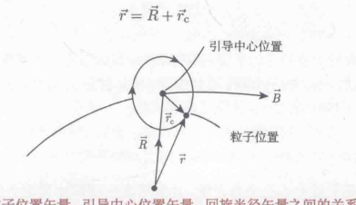
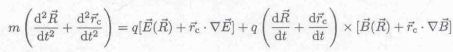
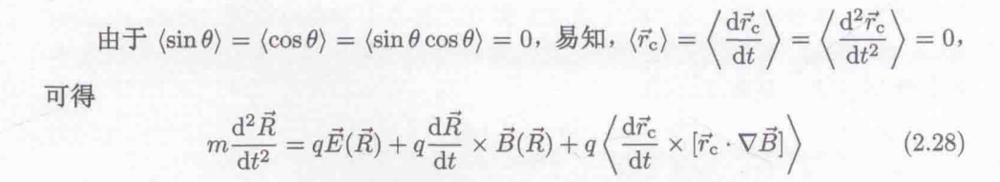
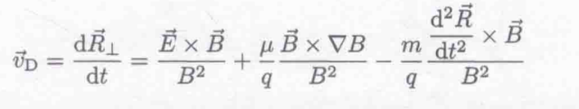

- 主要内容：给定电磁场下带电粒子的运动，不考虑粒子之间的相互作用，也不考虑粒子对电磁场的影响
	- $m\frac{d \vec {v}}{dt}=q(\vec {E}+\vec {v} \times \vec {B})+\vec {F}$
- 稳恒外场下的运动
	- 稳恒磁场中的粒子回旋运动
	  collapsed:: true
		- 圆周运动(回旋运动) #运动形式
		- 回旋频率与 荷质比和磁场有关 $qB/m$
		- 电子的回旋半径要远小于质子$\sqrt{m_e/m_p}<<1$
		- 引导中心(guiding center)→描述粒子在远大于回旋尺度上的平均运动
		- 磁矩与背景磁场是相反的→抗磁介质
		- 等离子体约束
			- 根由：回旋运动。垂直磁场的运动总是倾向于打旋，在大尺度运动中，平行于磁场的运动往往会得到延续
		-
		-
		-
	- 稳恒电场下的漂移运动
	  collapsed:: true
		- 坐标变化→ 回旋运动和回旋中心在垂直磁场方向中的运动（漂移运动）
			- 漂移速度于粒子性质无关，完全由电磁场决定
			- $$v_{DE}=\frac{\vec {E}\times \vec{B_0}}{B_0^2}$$
	- 重力场于任意外加力场中的导心偏移
- 弱变化磁场中粒子的运动
  id:: 631b00e5-d868-4312-89ea-039335cc0df3
	- 何为弱变化？ 缓慢
		- 时间尺度上，回旋周期上的变化忽略  $T_c|\frac{\partial {\vec B}}{\partial t}|<<B$
		- 空间尺度是，回旋半径上的变化忽略  $|\vec{r_c} \cdot \nabla {\vec B}|<<B$
	- 基本方法：运动分解→速度较快的回旋运动+粒子引导中心的慢速漂移运动
		- {:height 210, :width 373}
	- 运动方程
		- B进行一阶泰勒展开 $\vec{B}(\vec{r})=\vec{B}(\vec{R})+\vec{r}_c \cdot \nabla \vec B$
		- {:height 56, :width 411}
		- 时间周期上做平均： 
		- 最终进行处理得到引导中心的运动方程：
			- $$m\frac{d^2\vec R}{dt^2}=q\vec{E}(\vec{R})+q\frac{d \vec{R}}{dt}\times \vec{B}(\vec{R})-\mu \nabla B$$
		- 最后一项为粒子在一个回旋周期中算收到的平均力，μ为磁矩，与磁场的梯度变化有关
		- 垂直于磁场方向的运动速度
			- {:height 100, :width 486}
			- ExB漂移+磁场梯度漂移+引导中心惯性力导致的加速度漂移
		-
-
-