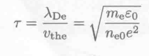
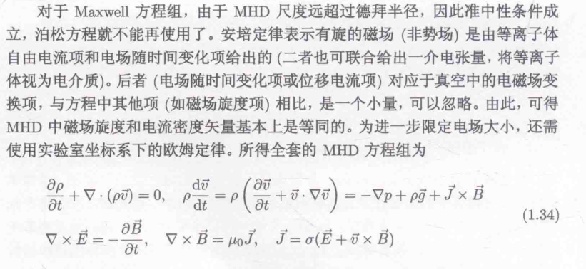

- 分类
  collapsed:: true
	- 自然界本就存在
		- 电离层-地球磁层中的介质
		- 磁层外的日球层空间
		- 太阳内部和太阳大气
		- 其他恒星系统
		- 星际空间
	- 人为制造
		- 低温等离子体
			- 等离子体显示、刻蚀、清洗
		- 高温等离子体
			- 受控热核聚变
- 电离度α
  collapsed:: true
	- 气体温度和密度决定
	- 高电离度→高温度，低密度
	- ‘电性’>‘中性’
		- 库仑相互作用：多体长距
		- 集体行为
- 集体行为
	- 等离子体振荡-langmuir振荡 #运动形式
		- 振荡频率由数密度决定←对于特定粒子
	- 徳拜屏蔽 debye shielding
		- q附近的电荷将q的电场线终止
		- 德拜球，德拜势
			- $\phi(r)=\frac{q}{4\pi \varepsilon_0 r}exp(-\frac{r}{\lambda_{De}})$
			- $\lambda_{De}^2=\frac{\varepsilon_0 k_{B} T_{e}}{n_{e0} e^2}$
			- 
			- 德拜半径与质量无关，只与电荷，温度，密度有关
		- 热运动与电场运动的相互作用平衡
- 准中性
  collapsed:: true
	- 允许微量的电荷涨落
	- 体系尺度>>λD
	- 时间尺度远大于等离子体的响应时间，即实现德拜屏蔽的时间
		- {:height 72, :width 198}
- 等离子体判据
  collapsed:: true
	- 表现出德拜屏蔽、准中性、等离子体振荡
	- 空间尺度L>>λD
	- 维持时间 T>>τ
	- 德拜球内的粒子数 A>>1
	- 电性>>中性：max(ωpe,vij)>>v(碰撞频率)
- 尺度
  collapsed:: true
	- 德拜半径
	- 电子和离子的回旋半径
	-
- 库仑碰撞
	- 经典库仑相互作用
	- 基于卢瑟福散射模型以及一维随机行走模型
	- 结论：密度越低、温度越高，库仑碰撞频率越低
	- 电子与电子之间的碰撞频率最高
- 对比等离子体振荡频率与库仑碰撞频率
  collapsed:: true
	- 集体相互作用频率要比库仑频率大得多
	- 库仑相互作用不可忽略时，称等离子体为碰撞的；反之为无碰撞的
	- 日冕、太阳风、磁层、星际风→无碰撞
	- 太阳光球层、色球层和地球电离层则不可忽略
- 一些尺度
  collapsed:: true
	- 
- 等离子体辐射
  collapsed:: true
	- 研究辐射可以实现对遥远天体和空间介质的参数和物理过程进行诊断
	- 分类
		- 非相干辐射(incoherent emission)：单个电荷运动为基础，韧致辐射、回旋同步辐射、能级跃迁等
		- 相干辐射(coherent emission)：等离子体不稳定性所激发
			- 电子束流所激发的等离子体辐射
			- 磁镜结构损失锥电子速度分布所激发的等离子体辐射
- 数学描述
	- Maxwell方程： {:height 145, :width 288}
	- 粒子数太多，不可能完全求解→近似处理
		- 假设离子的运动对于场没有影响，只研究给定外场下粒子的运动情况
		- 或将等离子体视作流体，考虑电磁力后用流体力学来研究等离子体的行为
			- 空间位置上流体元的密度、速度和温度等宏观性质
		- 动理论不关心某个粒子的行为，只关心找到粒子的概率
			- 单粒子轨道理论
			- 粒子模拟→高性能计算机数值模拟
	- 磁流体力学
	  collapsed:: true
		- 涉及参数：流体密度、速度、温度和压强
		- 描述大尺度的变化较为缓慢的物理过程，具体需要根据空间
		- 三个方程
			- 质量守恒方程
			- 动量守恒方程
			- 能量守恒方程
		- {:height 229, :width 487}
		- 动理学描述
			- {:height 115, :width 448}
			- 粒子受到自洽场的影响，该自洽场是空间位置和时间的函数，与粒子的速度无关
		- 无碰撞boltzmann方程(Vlasov方程)
			- {:height 152, :width 422}